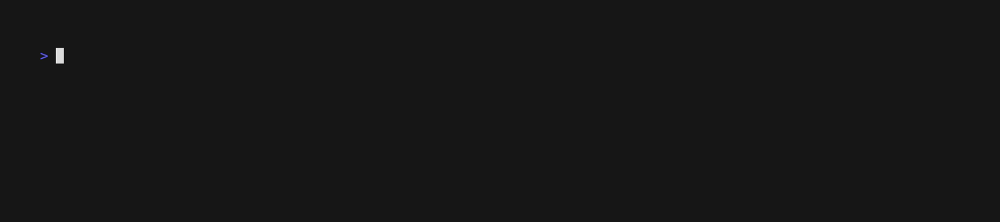

# sync2snipe
sync different data sources to snipe-it

# Overview
The goal of sync2snipe is to extend the functionality of jamf2snipe to other data sources.

[tosnipe.py](tosnipe.py) acts as a base upon which to add additional items.

By modularizing the codebase it should be fairly easy to mirror the logic in [jamf2.py](jamf2.py) to different MDM's, licensing data, Google Chrome devices, and more.

Code has been included for each data source so that this program remains self sufficent as possible. I attempted to map out the wonderful [Snipe-IT API](https://snipe-it.readme.io/reference/api-overview) for each endpoint. This should feasibly allow most information to be updated in Snipe-IT without having to write new code.

# Requirements
`python3 -m pip install -r requirements.txt`

# Configuration
The configuration resides in [settings.json](settings.json). This is a deviation from the `settings.conf` in jamf2snipe, but I found by using a json file the data was easier to parse and subsequently easier to read throughout the program.

# Authentication
By default, this will use [keyring](https://github.com/jaraco/keyring) to store your sensitive credentials in your keychain.


If you wish to use this program in a CI envrionment, or elsewhere, where the keychain is not a feasible option instantiate the class with `env_vars=True`.
```
j2s = Jamf2Snipe(env_vars=True)
```

An example of where this is set:
* In the [Snipe Class](snipe/__init__.py#L53)
* This calls the `get_config` function. If `env_vars` is set to True, the function will pull the values from the [environment](common/auth.py#L51-53).

# Logging
There are two options to configure:
## Verbosity Level
* Pass `--verbose` for high level information on what is occuring.
* Pass `--debug` for detailed information on what is occuring.

## Logging to file
* Pass `--log-to-file`
  - By [default](common/logger.pyL#21) this will log to `sync2snipe-$date_stamp.log`
  - To override this pass `--log-file` with the file you wish the logs to be written to.

# Sync Jamf items to Snipe
There were several changes to the architecture of jamf2snipe in this program that should significantly increase the speed.

Calls are made to Jamf and Snipe in the beggining to gather all of the information needed to compare what needs to be done. Subsequent calls to either API only occur when it is time to sync the information back to the source.
# Usage
All options show below
```
python3 jamf2.py -h
usage: jamf2.py [-h] [-d] [--disable-requests-logging] [--do_not_verify_ssl] [--dryrun] [-f] [-l] [-lf LOG_FILE] [-rt] [-s SETTINGS_FILE] [-v] [--auto_incrementing] [--do_not_update_jamf] [-u | -ui | -uf] [-uns] [-m | -c]

options:
  -h, --help            show this help message and exit
  -d, --debug           Sets logging to include additional DEBUG messages.
  --disable-requests-logging
                        In debug logging disables the requests library logs
  --do_not_verify_ssl   Skips SSL verification for all requests. Helpful when you use self-signed certificate.
  --dryrun              This checks your config and tries to contact both the JAMFPro and Snipe-it instances, but exits before updating or syncing any assets.
  -f, --force           Updates the Snipe asset with information every time, despite what the timestamps indicate.
  -l, --log-to-file     Output log results to file.
  -lf LOG_FILE, --log-file LOG_FILE
                        location of log file. defaults to sync2snipe-$date.log.
  -rt, --run-tests      Run startup tests to see if hosts are reachable.
  -s SETTINGS_FILE, --settings-file SETTINGS_FILE
                        location of settings file. defaults to settings.json.
  -v, --verbose         Sets the logging level to INFO and gives you a better idea of what the script is doing.
  --auto_incrementing   You can use this if you have auto-incrementing enabled in your snipe instance to utilize that instead of adding the Jamf ID for the asset tag.
  --do_not_update_jamf  Does not update Jamf with the asset tags stored in Snipe.
  -u, --users           Checks out the item to the current user in Jamf if it's not already deployed
  -ui, --users_inverse  Checks out the item to the current user in Jamf if it's already deployed
  -uf, --users_force    Checks out the item to the user specified in Jamf no matter what
  -uns, --users_no_search
                        Doesn't search for any users if the specified fields in Jamf and Snipe don't match. (case insensitive)
  -m, --mobiles         Runs against the Jamf mobiles endpoint only.
  -c, --computers       Runs against the Jamf computers endpoint only.
```

If you pass the `--dryrun` flag the program will run through each item logging what it _would_ be doing.


This currently implements all flags from jamf2snipe.

# Next Steps
* Anyone who has built a *-2snipe program - please reach out! I would like to add support for anything the community needs.
* I am working on code to sync ChromeOS, and other devices from Google Workspace, to Snipe. Following the pattern in this repo the Google API code will reside under [google](google).
* Adding an example Github Action workflow to use for [jamf2.py]
* Writing tests.

# Acknowledgements
* Without [jamf2snipe](https://github.com/grokability/jamf2snipe) this project wouldnt exist.
* The jamf python [library](https://github.com/univ-of-utah-marriott-library-apple/python-jamf) was the source for all the good bits of the jamf code.
